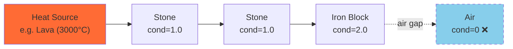

# Thermodynamica API Documentation

> **Mod ID:** `thermodynamica`  
> **Minecraft:** 1.20.1 · **Forge:** 47.4+  
> **Package:** `com.Tribulla.thermodynamica.api`

---

## Quick Start

```java
import com.Tribulla.thermodynamica.api.*;

HeatAPI api = HeatAPI.get();

// Query a block's heat tier
HeatTier tier = api.getResolvedTier(new ResourceLocation("minecraft:lava"));

// Query live simulated temperature at a world position (returns empty if not simulated)
OptionalDouble celsius = api.getSimulatedCelsius(level, pos);

// Easily query visual heat (prioritizes simulation, falls back to static dictionary)
double visualCelsius = api.getVisualCelsius(level, pos);

// Register a custom block as a heat source
api.registerBlockTier(new ResourceLocation("mymod:hot_block"), HeatTier.POS4);

// Listen for temperature changes
api.onTemperatureChange(event -> {
    // React to heat changes in the world
});
```

---

## Core Concepts

### Heat Tiers

Blocks are assigned to one of **11 discrete heat tiers**. Each tier maps to a nominal Celsius value defined in `config/Thermodynamica/tier_definitions.json`.

| Tier | ID | Index | Default °C | Description |
|------|------|-------|-----------|-------------|
| `NEG5` | `neg5` | −5 | −200 | Extreme cold |
| `NEG4` | `neg4` | −4 | −150 | Very cold |
| `NEG3` | `neg3` | −3 | −100 | Cold |
| `NEG2` | `neg2` | −2 | −50 | Cool |
| `NEG1` | `neg1` | −1 | −20 | Chilly |
| `ZERO` | `zero` | 0 | 0 | Freezing |
| **`POS1`** | `pos1` | 1 | **20** | **Ambient (default)** |
| `POS2` | `pos2` | 2 | 100 | Warm |
| `POS3` | `pos3` | 3 | 500 | Hot |
| `POS4` | `pos4` | 4 | 1000 | Very hot |
| `POS5` | `pos5` | 5 | 3000 | Extreme heat |

### BFS Heat Diffusion

Heat physically propagates block-to-block through solid materials using a parallel **Breadth-First Search** engine:

- Sources continuously emit their tier temperature into the world
- Heat flows through solid blocks based on **thermal conductivity** and **transfer rate**
- Air blocks act as insulators (heat does not cross air gaps)
- Water uses a configurable transfer multiplier (default 2×)
- When a source is removed, residual heat dissipates naturally



### Thermal Properties

Each block has three thermal properties that control how heat interacts with it:

| Property | Default | Description |
|----------|---------|-------------|
| `conductivity` | 1.0 | How readily heat flows through the block. 0 = insulator (air) |
| `transferRate` | 1.0 | Speed of heat transfer between adjacent blocks |
| `dissipationRate` | 0.05 | Rate of heat loss per exposed face per tick |

Configure per-block or per-tag in `config/Thermodynamica/thermal_properties.json`.

---

## API Reference

### `HeatAPI` — Main Entry Point

Obtain via `HeatAPI.get()`. Available after mod initialization.

#### Temperature Queries

| Method | Returns | Description |
|--------|---------|-------------|
| `getResolvedTier(ResourceLocation block)` | `HeatTier` | Block's assigned tier after conflict resolution |
| `getResolvedCelsius(ResourceLocation block, Level level, BlockPos pos)` | `double` | Block's tier temperature + biome offset |
| `getSimulatedCelsius(Level level, BlockPos pos)` | `OptionalDouble` | Live BFS-simulated temperature at position |
| `getVisualCelsius(Level level, BlockPos pos)` | `double` | Simulated temp if available, else resolved temp |
| `getSimulatedSourcesInChunk(Level level, ChunkPos pos)` | `Map<BlockPos, Double>` | All currently simulated temperatures within a chunk |
| `getTierCelsius(HeatTier tier)` | `double` | Nominal Celsius value for a tier |
| `getBiomeOffset(Level level, BlockPos pos)` | `double` | Biome temperature offset at position |
| `getAmbientTier()` | `HeatTier` | The ambient tier (default: `POS1`) |

#### Registration

| Method | Description |
|--------|-------------|
| `registerBlockTier(ResourceLocation block, HeatTier tier)` | Assign a block to a heat tier (highest priority) |
| `registerBlockCelsius(ResourceLocation block, double celsius)` | Assign exact Celsius value (maps to nearest tier) |

#### Conflict Resolution

```java
TierResolution resolution = api.resolveBlockTier(new ResourceLocation("minecraft:lava"));
// resolution.getSource()    → API, CONFIG, DATAPACK, or DEFAULT
// resolution.getPriority()  → numeric priority
// resolution.getMatchType() → BLOCK_STATE, BLOCK, or TAG
```

Priority order (highest wins): **API** > **Config** > **Data Pack** > **Default**

#### Events

```java
// Fires when a block's resolved tier changes (config reload, API registration)
api.onTierChange(event -> {
    ResourceLocation block = event.getBlock();
    HeatTier oldTier = event.getOldTier();
    HeatTier newTier = event.getNewTier();
});

// Fires when simulated temperature crosses the sync threshold
api.onTemperatureChange(event -> {
    Level level = event.getLevel();
    BlockPos pos = event.getPos();
    double oldTemp = event.getOldCelsius();
    double newTemp = event.getNewCelsius();
    HeatTier oldTier = event.getOldTier();
    HeatTier newTier = event.getNewTier();
});
```

#### Utility

| Method | Returns | Description |
|--------|---------|-------------|
| `isInTier(ResourceLocation block, HeatTier tier)` | `boolean` | Check if block resolves to a specific tier |
| `getThermalProperties(ResourceLocation block)` | `ThermalProperties` | Get block's thermal properties |
| `ClientHeatCache.getSnapshot()` | `Map<BlockPos, CachedHeatEntry>` | Get a thread-safe copy of the active client heat cache |
| `forceProcessChunks(int ticks)` | `void` | Force immediate background tick processing of the BFS heat engine |

#### Block Tags

The mod provides standard tags in `com.Tribulla.thermodynamica.api.ThermodynamicaTags`:
- `RADIATES_HEAT` (`#thermodynamica:radiates_heat`): Quickly check if a block emits heat without querying the tier registry.

---

## Configuration

All config files are in `config/Thermodynamica/`.

### `settings.json` — Simulation Settings

```jsonc
{
    "worker_threads": 2,           // ForkJoinPool thread count
    "work_budget_per_tick": 5000,  // Max frontier blocks processed per sim tick
    "simulation_interval_ticks": 20, // Sim ticks between BFS updates (20 = 1/sec)
    "delta_threshold": 0.5,        // Min °C change to trigger propagation
    "air_insulates": true,         // Air blocks block heat transfer
    "water_transfer_multiplier": 2.0,
    "dissipation_multiplier": 1.0,
    "sync_threshold": 5.0,        // Min °C change to sync to clients
    "sync_range": 64,             // Block radius for client sync
    "ambient_tier": "pos1"
}
```

### `tiers/` — Block Tier Assignments

Each tier has a JSON file (e.g. `pos5.json`):

```json
{
    "blocks": ["minecraft:lava", "minecraft:magma_block"],
    "tags": ["#minecraft:fire"]
}
```

### `thermal_properties.json` — Per-Block Physics

```json
{
    "blocks": {
        "minecraft:iron_block": { "conductivity": 2.0, "transfer_rate": 1.5, "dissipation_rate": 0.02 },
        "minecraft:wool": { "conductivity": 0.1, "transfer_rate": 0.3, "dissipation_rate": 0.01 }
    },
    "tags": {
        "#minecraft:logs": { "conductivity": 0.3, "transfer_rate": 0.5, "dissipation_rate": 0.03 }
    }
}
```

### `biomes.json` — Biome Temperature Offsets

```json
{
    "categories": { "cold": -15.0, "temperate": 0.0, "hot": 10.0 },
    "overrides": { "minecraft:desert": 15.0, "minecraft:snowy_plains": -25.0 }
}
```

---

## In-Game Commands

| Command | Description |
|---------|-------------|
| `/td status` | Show simulation status, source count, frontier size |
| `/td tps` | Show simulation TPS and timing stats |
| `/td reset` | Reset performance counters |
| `/td debug` | Toggle debug mode (full temp sync to client) |

---

## Adding Thermodynamica as a Dependency

In your `build.gradle`:

```groovy
dependencies {
    compileOnly fg.deobf("com.github.thermodynamica:thermodynamica:1.0.0")
}
```

In your `mods.toml`:

```toml
[[dependencies.yourmodid]]
    modId="thermodynamica"
    mandatory=false
    versionRange="[1.0.0,)"
    ordering="AFTER"
    side="BOTH"
```

Use `mandatory=false` if your mod can function without Thermodynamica (soft dependency).
