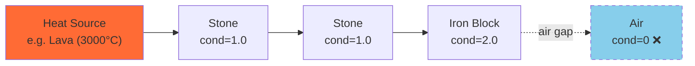

# Thermodynamica API Documentation

> **Mod ID:** `thermodynamica`  
> **Minecraft:** 1.20.1 · **Forge:** 47.4+  
> **Package:** `com.Tribulla.thermodynamica.api`

---

## Table of Contents

- [Quick Start](#quick-start)
- [Core Concepts](#core-concepts)
  - [Heat Tiers](#heat-tiers)
  - [BFS Heat Diffusion](#bfs-heat-diffusion)
  - [Thermal Properties](#thermal-properties)
  - [Default Block Assignments](#default-block-assignments)
- [API Reference](#api-reference)
  - [HeatAPI — Main Entry Point](#heatapi--main-entry-point)
  - [HeatTier Enum](#heattier-enum)
  - [CachedHeatEntry & ClientHeatCache](#cachedheatentry--clientheatcache)
- [Heat Targeting API](#heat-targeting-api)
  - [HeatTarget Record](#heattarget-record)
  - [HeatTargeting Utility Class](#heattargeting-utility-class)
  - [HeatAPI Targeting Methods](#heatapi-targeting-methods)
  - [Active Source Index](#active-source-index)
  - [Example: Heat-Seeking Missile](#example-heat-seeking-missile)
- [Valkyrien Skies Compatibility](#valkyrien-skies-compatibility)
  - [How It Works](#how-it-works)
  - [Ship Coordinate Handling](#ship-coordinate-handling)
  - [ValkyrienSkiesCompat API](#valkyrienSkiescompat-api)
- [Configuration](#configuration)
- [In-Game Commands](#in-game-commands)
- [Adding as a Dependency](#adding-thermodynamica-as-a-dependency)

---

## Quick Start

```java
import com.Tribulla.thermodynamica.api.*;

HeatAPI api = HeatAPI.get();

// Query a block's heat tier
HeatTier tier = api.getResolvedTier(new ResourceLocation("minecraft:lava"));

// Query live simulated temperature at a world position (returns empty if not simulated)
OptionalDouble celsius = api.getSimulatedCelsius(level, pos);

// Easily query visual heat (prioritizes simulation, falls back to static dictionary)
double visualCelsius = api.getVisualCelsius(level, pos);

// Register a custom block as a heat source
api.registerBlockTier(new ResourceLocation("mymod:hot_block"), HeatTier.POS4);

// Listen for temperature changes
api.onTemperatureChange(event -> {
    // React to heat changes in the world
});
```

---

## Core Concepts

### Heat Tiers

Blocks are assigned to one of **11 discrete heat tiers**. Each tier maps to a nominal Celsius value defined in `config/Thermodynamica/tier_definitions.json`.

| Tier | ID | Index | Default °C | Description |
|------|------|-------|-----------|-------------|
| `NEG5` | `neg5` | −5 | −200 | Extreme cold |
| `NEG4` | `neg4` | −4 | −150 | Very cold |
| `NEG3` | `neg3` | −3 | −100 | Cold |
| `NEG2` | `neg2` | −2 | −50 | Cool |
| `NEG1` | `neg1` | −1 | −20 | Chilly |
| `ZERO` | `zero` | 0 | 0 | Freezing |
| **`POS1`** | `pos1` | 1 | **20** | **Ambient (default)** |
| `POS2` | `pos2` | 2 | 100 | Warm |
| `POS3` | `pos3` | 3 | 500 | Hot |
| `POS4` | `pos4` | 4 | 1000 | Very hot |
| `POS5` | `pos5` | 5 | 3000 | Extreme heat |

### BFS Heat Diffusion

Heat physically propagates block-to-block through solid materials using a parallel **Breadth-First Search** engine:

- Sources continuously emit their tier temperature into the world
- Heat flows through solid blocks based on **thermal conductivity** and **transfer rate**
- Air blocks act as insulators (heat does not cross air gaps)
- **Fluid blocks (water, lava) are treated as insulators** — they return air-equivalent thermal properties and are skipped by the simulation for performance. Underground lava pools were the #1 source of simulation load.
- When a source is removed, residual heat dissipates naturally
- The engine uses a `ForkJoinPool` with configurable thread count for parallel processing
- A per-tick work budget limits CPU usage (default: 50,000 frontier blocks per tick)



### Thermal Properties

Each block has three thermal properties that control how heat interacts with it:

| Property | Default | Description |
|----------|---------|-------------|
| `conductivity` | 1.0 | How readily heat flows through the block. 0 = insulator (air) |
| `transferRate` | 1.0 | Speed of heat transfer between adjacent blocks |
| `dissipationRate` | 0.05 | Rate of heat loss per exposed face per tick |

Configure per-block or per-tag in `config/Thermodynamica/thermal_properties.json`.

### Default Block Assignments

On first launch, Thermodynamica generates tier config files with these defaults:

| Tier | Blocks |
|------|--------|
| **POS5** (3000°C) | *(empty — fluids excluded from simulation for performance)* |
| **POS4** (1000°C) | `fire`, `soul_fire`, `#minecraft:fire` |
| **POS3** (500°C) | `magma_block`, `campfire`, `soul_campfire` |
| **POS2** (100°C) | `furnace`, `blast_furnace`, `smoker`, `torch`, `wall_torch`, `soul_torch`, `soul_wall_torch`, `lantern`, `soul_lantern`, `glowstone`, `jack_o_lantern`, `shroomlight`, `redstone_lamp` |
| **ZERO** (0°C) | `ice` |
| **NEG1** (−20°C) | `packed_ice`, `snow_block`, `snow`, `powder_snow` |
| **NEG2** (−50°C) | `blue_ice` |

All other blocks default to **POS1** (ambient, 20°C). These can be overridden in the tier config files.

---

## API Reference

### `HeatAPI` — Main Entry Point

Obtain via `HeatAPI.get()`. Available after mod initialization.

#### Temperature Queries

| Method | Returns | Description |
|--------|---------|-------------|
| `getResolvedTier(ResourceLocation block)` | `HeatTier` | Block's assigned tier after conflict resolution |
| `getResolvedCelsius(ResourceLocation block, Level level, BlockPos pos)` | `double` | Block's tier temperature + biome offset |
| `getSimulatedCelsius(Level level, BlockPos pos)` | `OptionalDouble` | Live BFS-simulated temperature at position |
| `getVisualCelsius(Level level, BlockPos pos)` | `double` | Simulated temp if available, else resolved temp |
| `getSimulatedSourcesInChunk(Level level, ChunkPos pos)` | `Map<BlockPos, Double>` | All currently simulated temperatures within a chunk |
| `getTierCelsius(HeatTier tier)` | `double` | Nominal Celsius value for a tier |
| `getBiomeOffset(Level level, BlockPos pos)` | `double` | Biome temperature offset at position |
| `getAmbientTier()` | `HeatTier` | The ambient tier (default: `POS1`) |

#### Registration

| Method | Description |
|--------|-------------|
| `registerBlockTier(ResourceLocation block, HeatTier tier)` | Assign a block to a heat tier (highest priority) |
| `registerBlockCelsius(ResourceLocation block, double celsius)` | Assign exact Celsius value (maps to nearest tier) |

#### Conflict Resolution

```java
TierResolution resolution = api.resolveBlockTier(new ResourceLocation("minecraft:lava"));
// resolution.getSource()    → API, CONFIG, DATAPACK, or DEFAULT
// resolution.getPriority()  → numeric priority
// resolution.getMatchType() → BLOCK_STATE, BLOCK, or TAG
```

Priority order (highest wins): **API** > **Config** > **Data Pack** > **Default**

#### Events

```java
// Fires when a block's resolved tier changes (config reload, API registration)
api.onTierChange(event -> {
    ResourceLocation block = event.getBlock();
    HeatTier oldTier = event.getOldTier();
    HeatTier newTier = event.getNewTier();
});

// Fires when simulated temperature crosses the sync threshold
api.onTemperatureChange(event -> {
    Level level = event.getLevel();
    BlockPos pos = event.getPos();
    double oldTemp = event.getOldCelsius();
    double newTemp = event.getNewCelsius();
    HeatTier oldTier = event.getOldTier();
    HeatTier newTier = event.getNewTier();
});
```

#### Utility

| Method | Returns | Description |
|--------|---------|-------------|
| `isInTier(ResourceLocation block, HeatTier tier)` | `boolean` | Check if block resolves to a specific tier |
| `getThermalProperties(ResourceLocation block)` | `ThermalProperties` | Get block's thermal properties |
| `forceProcessChunks(int ticks)` | `void` | Force immediate background tick processing of the BFS heat engine |

#### Block Tags

The mod provides standard tags in `com.Tribulla.thermodynamica.api.ThermodynamicaTags`:
- `RADIATES_HEAT` (`#thermodynamica:radiates_heat`): Quickly check if a block emits heat without querying the tier registry.

### `HeatTier` Enum

```java
public enum HeatTier {
    NEG5(-5, "neg5"), NEG4(-4, "neg4"), NEG3(-3, "neg3"),
    NEG2(-2, "neg2"), NEG1(-1, "neg1"), ZERO(0, "zero"),
    POS1(1, "pos1"),  POS2(2, "pos2"),  POS3(3, "pos3"),
    POS4(4, "pos4"),  POS5(5, "pos5");
}
```

| Method | Returns | Description |
|--------|---------|-------------|
| `getIndex()` | `int` | Tier index (-5 to +5) |
| `getId()` | `String` | Tier string id (e.g. `"pos3"`) |
| `nearestTier(double celsius, double[] tierCelsius)` | `HeatTier` | Find the tier closest to a Celsius value |
| `fromId(String id)` | `HeatTier` | Parse tier from string id |
| `fromIndex(int index)` | `HeatTier` | Get tier by index |

### `CachedHeatEntry` & `ClientHeatCache`

Client-side heat data cache, automatically updated by server sync packets.

```java
// Get a thread-safe snapshot of all cached heat data (useful for rendering)
Map<BlockPos, CachedHeatEntry> snapshot = ClientHeatCache.getSnapshot();

// Query a single position
CachedHeatEntry entry = ClientHeatCache.get(pos);
if (entry != null) {
    double temp = entry.getCelsius();
    int tierOrdinal = entry.tierOrdinal();
}

// Clear the cache (e.g., on dimension change)
ClientHeatCache.clear();
```

| `CachedHeatEntry` Method | Returns | Description |
|--------------------------|---------|-------------|
| `celsius()` / `getCelsius()` | `double` | Temperature in Celsius |
| `tierOrdinal()` | `int` | Heat tier ordinal, or -1 if unknown |

---

## Heat Targeting API

The targeting API (`com.Tribulla.thermodynamica.api.targeting`) provides utilities for heat-seeking systems like missiles, drones, or thermal sensors.

### Quick Start

```java
import com.Tribulla.thermodynamica.api.HeatAPI;
import com.Tribulla.thermodynamica.api.targeting.*;

HeatAPI api = HeatAPI.get();
Vec3 missilePos = missile.position();

// Find the hottest block with line of sight within 64 blocks
HeatTarget target = api.getHottestWithLOS(level, missilePos, 64.0, 100.0);
if (target != null) {
    Vec3 targetPos = target.getCenter();
    double temp = target.getCelsius();
    // Guide missile toward target
}

// Or use the utility class directly for more control
List<HeatTarget> sources = HeatTargeting.getHeatSourcesWithLOS(level, missilePos, 64.0, 100.0);
```

### `HeatTarget` Record

Represents a potential heat target with position, temperature, and distance information. Implements `Comparable<HeatTarget>` (sorted by temperature, hottest first).

| Method | Returns | Description |
|--------|---------|-------------|
| `blockPos()` | `BlockPos` | The block position of the heat source |
| `celsius()` | `double` | Temperature in Celsius |
| `distanceSquared()` | `double` | Squared distance from origin |
| `hasLineOfSight()` | `boolean` | Whether LOS was confirmed (only set when LOS check was performed) |
| `getCenter()` | `Vec3` | Center position of the block |
| `getDistance()` | `double` | Actual distance (sqrt of distanceSquared) |
| `getTargetScore()` | `double` | Targeting score: `celsius / (1 + distance/10)` |
| `withLOS(boolean)` | `HeatTarget` | Create a copy with updated LOS status |

### `HeatTargeting` Utility Class

Static methods for finding and filtering heat sources.

#### Basic Queries (O(n³) block scan)

These methods scan a cubic area around the origin. Suitable for small radii (≤64 blocks).

| Method | Description |
|--------|-------------|
| `getHottestInRadius(level, origin, radius, minCelsius)` | Find the hottest block in radius (no LOS check) |
| `getHottestWithLOS(level, origin, radius, minCelsius)` | Find the hottest block visible from origin |
| `getHeatSourcesInRadius(level, origin, radius, minCelsius)` | Get all heat sources, sorted hottest-first |
| `getHeatSourcesWithLOS(level, origin, radius, minCelsius)` | Get all visible heat sources, sorted hottest-first |

#### Advanced Queries

| Method | Description |
|--------|-------------|
| `getBestTarget(level, origin, radius, minCelsius, requireLOS)` | Find best target considering both temperature AND distance |
| `getTargetsInCone(level, origin, direction, radius, coneAngle, minCelsius, requireLOS)` | Find targets within a forward-looking cone (e.g., 45° half-angle = 90° FOV) |
| `getNearestHeatSource(level, origin, radius, minCelsius, requireLOS)` | Find the closest heat source above threshold |
| `hasLineOfSight(level, from, to)` | Check if two positions have unobstructed line of sight |

### Active Source Index

For very large search areas (e.g., long-range missiles at 512+ blocks), the O(n³) block scan is too expensive. Use the **active source index** instead, which queries the simulation's internal data structure in O(sources) time:

```java
// Get ALL active heat sources in the dimension above a temperature threshold
// Returns ship-local coordinates for VS ship sources (see VS Compatibility section)
Map<BlockPos, Double> sources = api.getActiveHeatSources(level, 500.0);

// Or use the targeting utility (uses source index internally, adds distance/LOS filtering)
List<HeatTarget> targets = HeatTargeting.getActiveHeatSources(level, origin, 128.0, 100.0, true);
```

| Method | Returns | Description |
|--------|---------|-------------|
| `HeatAPI.getActiveHeatSources(level, minCelsius)` | `Map<BlockPos, Double>` | All active sources in dimension above threshold |
| `HeatTargeting.getActiveHeatSources(level, origin, radius, minCelsius, checkLOS)` | `List<HeatTarget>` | Active sources within radius, with optional LOS check |

> **Note:** `getActiveHeatSources` returns positions in their **native coordinate space**. For blocks on Valkyrien Skies ships, these are ship-local (shipyard) coordinates. You must transform them to world coordinates for distance/direction calculations. See [VS Compatibility](#valkyrien-skies-compatibility).

### HeatAPI Targeting Methods

For convenience, the main `HeatAPI` exposes common targeting methods directly:

| Method | Returns | Description |
|--------|---------|-------------|
| `getHottestInRadius(level, origin, radius, minCelsius)` | `HeatTarget` | Hottest block in radius |
| `getHottestWithLOS(level, origin, radius, minCelsius)` | `HeatTarget` | Hottest visible block |
| `getHeatSourcesInRadius(level, origin, radius, minCelsius)` | `List<HeatTarget>` | All sources sorted by temp |
| `getHeatSourcesWithLOS(level, origin, radius, minCelsius)` | `List<HeatTarget>` | Visible sources sorted by temp |
| `getBestTarget(level, origin, radius, minCelsius, requireLOS)` | `HeatTarget` | Best overall target |
| `getTargetsInCone(level, origin, direction, radius, coneAngle, minCelsius, requireLOS)` | `List<HeatTarget>` | Targets in forward cone |
| `hasLineOfSight(level, from, to)` | `boolean` | Check LOS between positions |
| `getActiveHeatSources(level, minCelsius)` | `Map<BlockPos, Double>` | All active sources in dimension |

### Example: Heat-Seeking Missile

A realistic heat-seeking missile using proportional navigation guidance:

```java
public class HeatSeekingMissile {
    private Vec3 currentTargetPos = null;
    private int targetLostTicks = 0;
    
    // Seeker parameters
    private double seekerFov = 45.0;      // Half-angle in degrees
    private double seekerRange = 512.0;   // Max detection range in blocks
    private double seekerMinTemp = 100.0; // Min temperature to track (°C)
    private double turnRate = 4.0;        // Max degrees per tick
    
    public void tickGuidance(Entity missile, Level level) {
        Vec3 pos = missile.position();
        Vec3 velocity = missile.getDeltaMovement();
        if (velocity.lengthSqr() < 0.01) return;
        
        Vec3 lookDir = velocity.normalize();
        HeatAPI api = HeatAPI.get();
        
        // === TARGET ACQUISITION ===
        // Use the active source index for efficient long-range search
        Map<BlockPos, Double> sources = api.getActiveHeatSources(level, seekerMinTemp);
        
        Vec3 bestTarget = null;
        double bestTemp = seekerMinTemp;
        double rangeSq = seekerRange * seekerRange;
        
        for (Map.Entry<BlockPos, Double> entry : sources.entrySet()) {
            BlockPos sourcePos = entry.getKey();
            double temp = entry.getValue();
            Vec3 worldPos = Vec3.atCenterOf(sourcePos);
            
            // For VS ship sources, transform ship-local → world coordinates
            // (see VS Compatibility section for how to detect and transform)
            
            // Range check
            double distSq = pos.distanceToSqr(worldPos);
            if (distSq > rangeSq) continue;
            
            // Temperature priority
            if (temp <= bestTemp && bestTarget != null) continue;
            
            // FOV check (seeker cone)
            Vec3 toTarget = worldPos.subtract(pos).normalize();
            double dot = lookDir.dot(toTarget);
            if (dot < 0) continue; // Behind missile
            double angle = Math.toDegrees(Math.acos(Math.min(1.0, dot)));
            if (angle > seekerFov) continue;
            
            bestTarget = worldPos;
            bestTemp = temp;
        }
        
        if (bestTarget != null) {
            currentTargetPos = bestTarget;
            targetLostTicks = 0;
        } else {
            targetLostTicks++;
        }
        
        // === PROPORTIONAL NAVIGATION STEERING ===
        if (currentTargetPos != null && targetLostTicks <= 10) {
            double speed = velocity.length();
            Vec3 currentDir = velocity.normalize();
            Vec3 desiredDir = currentTargetPos.subtract(pos).normalize();
            
            double angleDeg = Math.toDegrees(Math.acos(
                Math.min(1.0, Math.max(-1.0, currentDir.dot(desiredDir)))
            ));
            
            // Speed-dependent turn authority
            double speedFactor = Math.min(1.0, speed / 1.0);
            double effectiveTurn = turnRate * speedFactor;
            
            // Reduce authority for extreme angles (prevent U-turns)
            if (angleDeg > 45.0) {
                effectiveTurn *= 1.0 - ((angleDeg - 45.0) / 135.0) * 0.6;
            }
            effectiveTurn = Math.max(0.5, effectiveTurn);
            
            if (angleDeg > effectiveTurn) {
                double t = effectiveTurn / angleDeg;
                Vec3 newDir = slerp(currentDir, desiredDir, t);
                missile.setDeltaMovement(newDir.scale(speed));
            } else {
                missile.setDeltaMovement(desiredDir.scale(speed));
            }
        }
        
        if (targetLostTicks > 20) {
            currentTargetPos = null;
        }
    }
    
    private Vec3 slerp(Vec3 from, Vec3 to, double t) {
        double dot = Math.max(-1.0, Math.min(1.0, from.dot(to)));
        double theta = Math.acos(dot);
        if (Math.abs(theta) < 0.001) {
            return from.scale(1 - t).add(to.scale(t)).normalize();
        }
        double sinTheta = Math.sin(theta);
        double a = Math.sin((1 - t) * theta) / sinTheta;
        double b = Math.sin(t * theta) / sinTheta;
        return from.scale(a).add(to.scale(b)).normalize();
    }
}
```

**Key design notes:**
- **Turn rate of 4°/tick** (80°/sec) produces smooth, realistic arcs. Values above 10°/tick cause zigzag patterns seen in pure pursuit guidance.
- **Speed-dependent authority** means slow missiles can't turn as sharply — they'll arc wide instead of U-turning.
- **Anti-U-turn damping** reduces turn authority when the target is behind the missile, preventing physically impossible 180° reversals.
- **Slerp interpolation** ensures the missile's velocity vector rotates smoothly on the unit sphere instead of cutting corners.

---

## Valkyrien Skies Compatibility

Thermodynamica fully supports Valkyrien Skies 2 ships. Heat simulation, diffusion, and targeting all work on ship blocks.

### How It Works

VS2 stores ship blocks in a special **shipyard** coordinate space (very high coordinates far from the overworld). The blocks are accessible via standard `level.getBlockState(shipLocalPos)` calls — no special handling needed for block access.

However, for **distance calculations**, **line-of-sight checks**, and **rendering**, you need the block's position in world space.

```
┌─ Shipyard Space ─────────────┐     ┌─ World Space ──────────────┐
│ Ship blocks stored at         │     │ Ship rendered at           │
│ (700000, 64, 700000) etc.    │ ──► │ (100, 65, 200) etc.       │
│                               │     │                            │
│ getBlockState() works here   │     │ Distance/LOS checks here  │
│ Heat simulation runs here    │     │ Missile guidance uses this │
└───────────────────────────────┘     └────────────────────────────┘
              Ship Transform (getShipToWorld matrix)
```

### Ship Coordinate Handling

**Heat simulation** operates in native (ship-local) coordinates:
- `HeatSimulationManager.markActive()`, `setTemperature()`, `getTemperature()` all use native `BlockPos` — never transform coords
- `level.getBlockState(pos)` correctly returns ship blocks at their ship-local positions
- BFS propagation works naturally because adjacent ship blocks have adjacent ship-local positions

**Targeting / missiles** need world coordinates:
- `getActiveHeatSources()` returns positions in native coords (ship-local for ship blocks)
- Consumers must detect ship sources and transform to world coords for distance/direction math
- Use `isBlockInShipyard()` to detect if a source is on a ship
- Use ship's `ShipTransform.getShipToWorld()` matrix to transform positions

### `ValkyrienSkiesCompat` API

Located in `com.Tribulla.thermodynamica.api.compat`. Uses reflection to avoid compile-time dependency.

| Method | Returns | Description |
|--------|---------|-------------|
| `isVSInstalled()` | `boolean` | Whether VS2 is loaded and compatible |
| `isOnShip(level, pos)` | `boolean` | Check if a block position is managed by a ship |
| `getShipManagingPos(level, pos)` | `Object` | Get the Ship object for a position, or null |
| `toWorldPos(level, pos)` | `BlockPos` | Transform ship-local BlockPos to world BlockPos |
| `toWorldCoordinates(level, shipBlockPos, shipLocalPos)` | `Vec3` | Transform ship-local Vec3 to world Vec3 |
| `toShipCoordinates(level, shipBlockPos, worldPos)` | `Vec3` | Transform world Vec3 to ship-local Vec3 |
| `transformDirectionToWorld(level, shipBlockPos, dir)` | `Vec3` | Transform direction vector (no translation) |
| `transformDirectionToShip(level, shipBlockPos, dir)` | `Vec3` | Transform world direction to ship-local |
| `getShipVelocity(level, shipBlockPos)` | `Vec3` | Get ship's linear velocity |
| `getShipWorldPosition(level, shipBlockPos)` | `Vec3` | Get ship's center of mass in world coords |

> **Important:** Do NOT call `toWorldPos()` or `toWorldCoordinates()` before `level.getBlockState()`. VS2 blocks exist at their ship-local positions and are directly accessible. Only transform for distance/direction calculations.

---

## Configuration

All config files are in `config/Thermodynamica/`.

### `settings.json` — Simulation Settings

```jsonc
{
    "worker_threads": 2,              // ForkJoinPool thread count
    "work_budget_per_tick": 50000,    // Max frontier blocks processed per sim tick
    "graceful_degradation": true,     // Reduce work when server is behind
    "simulation_interval_ticks": 20,  // Sim ticks between BFS updates (20 = 1/sec)
    "delta_threshold": 0.5,           // Min °C change to trigger propagation
    "air_insulates": true,            // Air blocks block heat transfer
    "water_transfer_multiplier": 2.0, // ⚠️ Legacy — fluids are now treated as insulators regardless
    "dissipation_multiplier": 1.0,
    "smoothing_enabled": true,        // Enable temperature smoothing
    "smoothing_radius": 2,            // Block radius for smoothing
    "smoothing_budget": 500,          // Max blocks smoothed per tick
    "sync_threshold": 20.0,           // Min °C change to sync to clients
    "sync_range": 64,                 // Block radius for client sync
    "debug_mode": false,              // Full temp sync (for development)
    "max_propagation_radius": 16,     // Max BFS radius from each source
    "ticks_per_radius_step": 5,       // Ticks before expanding BFS by 1 block
    "temperature_ramp_rate": 0.15,    // Per-tick temp ramp factor (0.01–1.0)
    "ambient_tier": "pos1"
}
```

> **Note:** `water_transfer_multiplier` is still loadable from config but has no effect — all fluid blocks (water, lava) are treated as insulators by the BFS engine for performance reasons.

### `heat/` — Block Tier Assignments

Each tier has a JSON file (e.g. `heat/pos5.json`):

```json
{
    "blocks": ["minecraft:lava"],
    "tags": []
}
```

### `thermal_properties.json` — Per-Block Physics

```json
{
    "blocks": {
        "minecraft:iron_block": { "conductivity": 2.0, "transfer_rate": 1.5, "dissipation_rate": 0.02 },
        "minecraft:wool": { "conductivity": 0.1, "transfer_rate": 0.3, "dissipation_rate": 0.01 }
    },
    "tags": {
        "#minecraft:logs": { "conductivity": 0.3, "transfer_rate": 0.5, "dissipation_rate": 0.03 }
    }
}
```

### `biomes.json` — Biome Temperature Offsets

```json
{
    "categories": { "cold": -15.0, "temperate": 0.0, "hot": 10.0 },
    "overrides": { "minecraft:desert": 15.0, "minecraft:snowy_plains": -25.0 }
}
```

---

## In-Game Commands

| Command | Description |
|---------|-------------|
| `/td status` | Show simulation status, source count, frontier size |
| `/td tps` | Show simulation TPS and timing stats |
| `/td reset` | Reset performance counters |
| `/td debug` | Toggle debug mode (full temp sync to client) |

---

## Adding Thermodynamica as a Dependency

In your `build.gradle`:

```groovy
repositories {
    flatDir { dirs 'libs' }
}

dependencies {
    // Use fg.deobf() with a Maven coordinate (requires flatDir repo or real Maven repo)
    compileOnly fg.deobf("thermodynamica:thermodynamica:1.0.0")
    
    // Or for runtime dependency:
    // implementation fg.deobf("thermodynamica:thermodynamica:1.0.0")
}
```

In your `mods.toml`:

```toml
[[dependencies.yourmodid]]
    modId="thermodynamica"
    mandatory=false
    versionRange="[1.0.0,)"
    ordering="AFTER"
    side="BOTH"
```

Use `mandatory=false` if your mod can function without Thermodynamica (soft dependency). Wrap all API calls in try-catch or check `ModList.get().isLoaded("thermodynamica")` before use.
